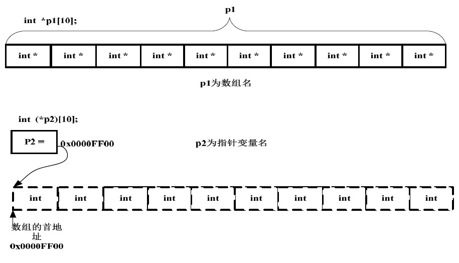
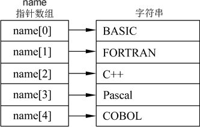
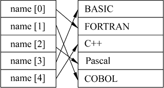
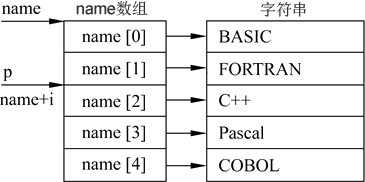
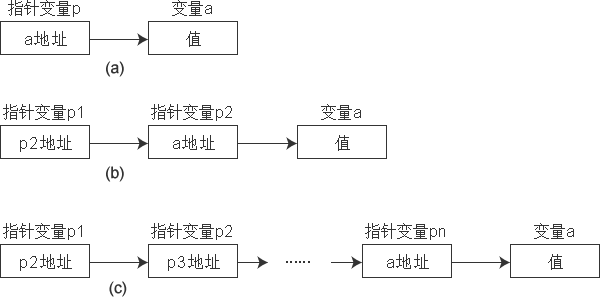
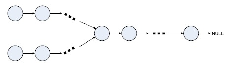

# 指针与引用
指针是 `c` 系语言的特色。指针是 `c++` 提供的一种颇具特色的数据类型，允许直接获取和操纵数据地址，实现动态存储分配。

指针是 `c` 和 `c++` 的精华所在，也是 `c` 和 `c++` 中一个十分重要的概念。一个数据对象的内存地址称为该数据对象的指针。指针可以表示各种数据对象，如简单变量、数组、数组元素、结构体，甚至函数。换句话说，指针具有不同的类型，可以指向不同的数据存储体。 

## 基本问题

**例题1：**指针和引用的差别？

**答案：**

1. 非空区别。在任何情况下都不能使用指向空值的引用。
2. 合法性区别。在使用引用之前不需要测试它的合法性。指针则应该总是被测试，防止其为空。
3. 可修改区别。指针与引用的另一个重要的区别是指针可以被重新赋值以指向另一个不同的对象。但是引用则总是指向在初始化时被指定的对象，但是指定的对象其内容可以改变。

**例题2：**看下面的程序哪里出错?  

```
#include <iostream>
using namespace std;
int main()
{
    int iv;							//1
    int iv2 = 1024;					//2
    int iv3 = 999;					//3
    int &reiv;						//4
    int &reiv2 = iv;				//5
    int &reiv3 = iv;				//6
    int *pi;						//7
    int *pi = 5;					//8
    pi = &iv3;						//9
    const double di;				//10
    const double maxWage = 10.0;	//11
    const double minWage = 0.5;		
    const double *pc = &maxWage	;	//12
    
    cout << pi;
    return 0;
}
```

答案：4、8、10错误。

## 传递动态内存

**试题1：**两个数的交换。

```
#include <iostream>
using namespace std;

void swap(int a, int b)
{
	int temp;
	temp = a;
	a = b;
	b = temp;
}

void swap1(int *a, int *b)
{
	int temp;
	temp = *a;
	*a = *b;
	*b = temp;
}

void swap2(int &a, int &b)
{
	int temp;
	temp = a;
	a = b;
	b = temp;
}

int main()
{
	int a = 1, b = 2;
	swap(a, b);
	cout << a << " " << b << endl;
	swap1(&a, &b);
	cout << a << " " << b << endl;
	swap2(a, b);
	cout << a << " " << b << endl;
}
```

### 指针数组和数组指针

下面到底哪个是数组指针，哪个是指针数组呢：

A. `int *p1[10]`
B. `int (*P2)[10]`

`[]` 的优先级比 `*` 要高。p1 先与 `[]` 结合，构成一个数组的定义，数组名为 `p1` ，`int *` 修饰的是数组的内容，即数组的每个元素。那现在我们清楚，这是一个数组，其包含10个指向 `int` 类型数据的指针，即指针数组。至于 `p2` 就更好理解了，在这里 `()` 的优先级比 `[]` 高，`*` 号和 `p2` 构成一个指针的定义，指针变量名为 `p2`，`int` 修饰的是数组的内容，即数组的每个元素。数组在这里并没有名字，是个匿名数组。那现在我们清楚 `p2` 是一个指针，它指向一个包含10 个 `int` 类型数据的数组，即数组指针。我们可以借助下面的图加深理解：

<center>

<p>图1</P>
</center>

**例题3：**程序的输出。

```
//out.c

#include <stdio.h>

int main(int argc, char** argv)
{
	int a[5] = {1,2,3,4,5};
	int* ptr = (int*)(&a + 1);
	printf("%d,%d\n", *(a+1), *(ptr-1));
	return 0;
}
```

这道题简单，但是考察了不少于如下内容：数组指针、数组首地址概念、数组指针和数组首地址和数组首元素地址之间的关系，指针运算规则，指针类型，int型长度，指针长度，类型转换等，这些概念如果有一个及以上不是那么太清楚的话，很容易答错。

**分析：**

1. `a` 是数组地址，根据 C语言语义，即数组首元素的地址，首元素是 `int` 类型，故首元素地址应为 `int*` 类型，故 `a` 的类型为 `int*`；
2. `&a` 是数组指针，其值与 `a` 相同，但含义却不同，即类型不同，`&a` 准确的类型是 `int (*)[5]`。

理解了这两点的话，上述问题则十分简单：

1. `a + 1` ：现在把 `a` 看作一个指针，指针 `+1` 操作，根据C语言语义，实际增加偏移量的是指针指向类型的长度，即32位机器下的 `int` 型，即4字节，故 `a+1` 就是 `&a[1]`，那么 `*(a+1)` 就是`a[1]`，即 `2`;
2. `&a + 1` ：现在把 `&a` 看作一个指针 `int (*b)[5]`，那么 `&a + 1` 实际增加的偏移量是其指向类型 `(int (*)[5])` 的长度，即20字节，故 `&a + 1` 其实是 `a+5`，即 `&a[5]`。
3. 现在已知 `&a+1` 的值是 `a+5`，但其类仍然是 `int (*)[5]`，现在 `ptr` 指向 `&a+1` 且通过强制类型转换变成了 `int*`，那么 `ptr-1` 是什么呢？因为 `ptr` 已经是 `int*` 类型了，`ptr-1` 即向前移动4字节，即 `a+4`，即 `&a[4]`，那么 `*(ptr-1)` 就是 `a[4]`，即 `5`。

以下关系的值（地址）是一样的:`a = &a = &a[0]`

**例题3：**下面的程序的输出是什么？

```
#include <iostream>
#include <stdio.h>
using namespace std;

int main()
{
	int v[2][10] = {{1,2,3,4,5,6,7,8,9,10},
					{11,12,13,14,15,16,17,18,19,20}};
	int (*a)[10] = v;
	
	cout << **a << endl;
	cout << **(a+1) << endl;
	cout << *(*a+1) << endl;
	cout << *(a[0]+1) << endl;
	cout << *(a[1]) << endl;
	return 0;
}
```

答案：结果是 1 11 2 2 11。

**例题4：**区分指针数组与二维数组.

举例 : 

- `int array[2][5];`
- `int *arrayp[2];`

*二维数组* : 上面的 `array[2][5]` 是二维数组;

- 空间分配 : 分配了 `2 * 5 * sizeof(int)` 大小的内存空间;
- 计算元素地址 : `5 * row + col` 是 `array[row][col]` 的地址;

```
// montharray.c

#include <stdio.h>  
  
char *month_name(int n)  
{  
        /* 
         * 初始化指针数组, 指针数组中的元素指向一个字符串 
         */  
        static char name[][20] = {  
                "Illegal month",   
                "January", "Febrary", "March",  
                "April", "May", "June",  
                "July", "August", "September",  
                "October", "November", "December"  
        };  
  
        printf("sizeof(name) = %lu \n", sizeof(name));  
  
        //返回一个指针, 这个指针指向字符串  
        return (n < 1 || n > 12) ? name[0] : name[n];  
}  
  
int main(int argc, char **argv)  
{  
        printf("month 2 is %s \n", month_name(2));  
        return 0;  
} 
```

*指针数组* : `*array[2]` 是指针数组;

- 空间分配 : 分配了10个指针, 没有对指针进行初始化, 必须进行手动初始化, 指针指向的一维数组长度可变, 不固定;
- 作用 : 指针数组最主要的作用是存放不同长度的字符串;


```
// monthp.c

#include<stdio.h>  
  
char *month_name(int n)  
{  
        /* 
         * 初始化指针数组, 指针数组中的元素指向一个字符串 
         */  
        static char *name[] = {  
                "Illegal month",   
                "January", "Febrary", "March",  
                "April", "May", "June",  
                "July", "August", "September",  
                "October", "November", "December"  
        };  
  
        printf("sizeof(name) = %lu \n", sizeof(name));  
        //返回一个指针, 这个指针指向字符串  
        return (n < 1 || n > 12) ? name[0] : name[n];  
}  
  
int main(int argc, char **argv)  
{  
        printf("month 2 is %s \n", month_name(2));  
        return 0;  
}
```

**对比：**二维数组占用了260字节内存，指针数组占用了104字节的内存。

**例题5：**若干字符串按字母顺序（从大到小）输出。

```
#include <iostream>
using namespace std;

void sort(char *name[],int n)
{
    char *temp;
    int i,j,k;
    for(i=0;i<n-1;i++)
    {
        k=i;
        for(j=i+1;j<n;j++)
            if(strcmp(name[k],name[j])>0) k=j;
        if(k!=i)
        {
            temp=name[i];name[i]=name[k];name[k]=temp;
        }
    }
}

void print(char *name[],int n)
{
    int i;
    for(i=0;i<n;i++)
        cout<<name[i]<<endl;
}

int main( )
{
    char *name[]={"BASIC","FORTRAN","C++","Pascal","COBOL"};  //定义指针数组
    int n=5;
    sort(name,n);
    print(name,n);
    return 0;
}
```

<center>

<p>图2</P>
<br>
</center>

<center>

<p>图3</P>
</center>


## 指向指针的指针

在掌握了指针数组的概念的基础上，下面介绍指向指针数据的指针，简称为指向指针的指针。从图2可以看到，`name` 是一个指针数组，它的每一个元素是一个指针型数据(其值为地址)，分别指向不同的字符串。数组名name代表该指针数组首元素的地址。`name+i` 是 `name[i]` 的地址。由于 `name[i]` 的值是地址(即指针)，因此 `name+i` 就是指向指针型数据的指针。还可以设置一个指针变量 `p`，它指向指针数组的元素(见图4)。p就是指向指针型数据的指针变量。

<center>

<p>图4</P>
</center>


**例题6：**下面的测试程序会有什么结果？

```
#include <iostream>

void getMemory(char *p, int num)
{
	p = (char *)malloc(sizeof(char) * num);
}

int main()
{
	char *str = NULL;
	getMemory(str, 10);
	strcpy(str, "hello");
	return 0;
}
```

**答案：**程序崩溃。函数不能传递动态内存，`str` 一直是 `NULL`。毛病出在函数 `getMemory` 中。函数中 `*p` 实际上是主函数中 `str` 的一个副本，编译器总是要为函数的每个参数制作临时副本。在本例中，`p` 申请了新的内存，只是把 `p` 所指向的内存地址改变了，但是 `str` 丝毫未变。因为函数没有返回值，因此 `str` 并不指向 `p` 所申请的那段内存。所以函数并不能输出任何东西。事实上，每执行一次函数就会申请一块内存，但申请的内存却不能有效释放，结果是内存一直被独占，最终导致内存泄漏。  
如果一定要用指针参数去申请内存，那么应该采用指向指针的指针，传 `str` 的地址给函数。代码修改如下：

```
// memory.cpp

#include <iostream>
using namespace std;

void getMemory(char **p, int num)
{
	*p = (char *)malloc(sizeof(char) * num);
}

int main()
{
	char *str = NULL;
	getMemory(&str, 10);
	strcpy(str, "hello");
	cout << *str << endl;
	cout << str << endl;
	cout << &str << endl;
	return 0;
}
```

**例题7：**指向字符型数据的指针变量。

```
// pp.cpp

#include <iostream>
using namespace std;
int main( )
{
    char **p;				//定义指向字符指针数据的指针变量p
    char *name[] = {"BASIC","FORTRAN","C++","Pascal","COBOL"};
    p = name + 2;  			//见图5中p的指向
    cout << *p <<endl;  	//输出name[2]指向的字符串
    cout << **p <<endl;  	//输出name[2]指向的字符串中的第一个字符
}
```

如果在一个指针变量中存放一个目标变量的地址，这就是“单级间址”，见图5(a)。指向指针的指针用的是“二级间址”方法。见图5(b)。从理论上说，间址方法可以延伸到更多的级，见图5(c)。但实际上在程序中很少有超过二级间址的。

<center>

<p>图5</P>
</center>

## 链表相关

**例题：**输入一个单向链表，判断链表是否有环？

**分析：**通过两个指针，分别从链表的头节点出发，一个每次向后移动一步，另一个移动两步，两个指针移动速度不一样，如果存在环，那么两个指针一定会在环里相遇。

```
bool hasCircle(Node *head,Node *&circleNode)
{
    Node *slow,*fast;
    slow = fast = head;
    while(fast != NULL && fast->next != NULL)
    {
        fast = fast->next->next;
        slow = slow->next;
        if(fast == slow)
        {
            circleNode = fast;
            return true;
        }
    }

    return false;
}
```

**例题：**给出两个单向链表的头指针（如下图所示），

<center>

<p>图6</P>
</center>

比如h1、h2，判断这两个链表是否相交。这里为了简化问题，我们假设两个链表均不带环。

**分析：**

1. 直接循环判断第一个链表的每个节点是否在第二个链表中。但，这种方法的时间复杂度为 `O(Length(h1) * Length(h2))`。

2. 针对第一个链表直接构造 `hash` 表，然后查询 `hash` 表，判断第二个链表的每个节点是否在 `hash` 表出现，如果所有的第二个链表的节点都能在 `hash` 表中找到，即说明第二个链表与第一个链表有相同的节点。时间复杂度为为线性：`O(Length(h1) + Length(h2))`，同时为了存储第一个链表的所有节点，空间复杂度为`O(Length(h1))`。

3. 转换为环的问题。把第二个链表接在第一个链表后面，如果得到的链表有环，则说明两个链表相交。如果有环，则第二个链表的表头一定也在环上，即第二个链表会构成一个循环链表，我们只需要遍历第二个链表，看是否会回到起始点就可以判断出来。这个方法的时间复杂度是线性的，空间是常数。

4. 进一步考虑“如果两个没有环的链表相交于某一节点，那么在这个节点之后的所有节点都是两个链表共有的”这个特点，我们可以知道，如果它们相交，则最后一个节点一定是共有的。而我们很容易能得到链表的最后一个节点，所以这成了我们简化解法的一个主要突破口。那么，我们只要判断两个链表的尾指针是否相等。相等，则链表相交；否则，链表不相交。
所以，先遍历第一个链表，记住最后一个节点。然后遍历第二个链表，到最后一个节点时和第一个链表的最后一个节点做比较，如果相同，则相交，否则，不相交。这样我们就得到了一个时间复杂度，它为 `O((Length(h1) + Length(h2))`，而且只用了一个额外的指针来存储最后一个节点。这个方法时间复杂度为线性 `O(N)`，空间复杂度为 `O(1)`，显然比解法3更胜一筹。

```
bool isIntersect(Node *h1,Node *h2)
{
    if(h1 == NULL || h2 == NULL) return false;    //异常判断
    while(h1->next != NULL)
    {
        h1 = h1->next;
    }

    while(h2->next != NULL)
    {
        h2 = h2->next;
    }

    if(h1 == h2) return true;        //尾节点是否相同
    else return false;
}

```

## 其他

### 睡眠排序

睡眠排序可以认为是上面意大利面条排序的计算机实现版。对于数组中的每个数，都对应一个会睡眠这么长时间的线程。例如对于 `[4,2,3,5,9]` 这样一组数，就创建5个线程，每个线程睡眠4s，2s，3s，5s，9s。这些线程睡醒之后，就把自己对应的数报出来即可。有的人觉得睡眠排序可能效率不高，其实可以将每个线程睡眠的时间单位设的尽可能小一些来加速。但是真正实现起来，多线程的诸多问题让这个算法基本上只是一个概念。

**Java实现**

```
public class SleepSort {
    public static void main(String[] args) {
        int[] ints = {1,4,7,3,8,9,2,6,5};
        SortThread[] sortThreads = new SortThread[ints.length];
        for (int i = 0; i < sortThreads.length; i++) {
            sortThreads[i] = new SortThread(ints[i]);
        }
        for (int i = 0; i < sortThreads.length; i++) {
            sortThreads[i].start();
        }
    }
}
class SortThread extends Thread{
    int ms = 0;
    public SortThread(int ms){
        this.ms = ms;
    }
    public void run(){
        try {
            sleep(ms*10+10);
        } catch (InterruptedException e) {
            // TODO Auto-generated catch block
            e.printStackTrace();
        }
        System.out.println(ms);
    }
}
```

**C实现**

```
#include <stdlib.h>
#include <unistd.h>
#include <sys/types.h>
#include <sys/wait.h>
 
int main(int c, char **v)
{
        while (--c > 1 && !fork());
        sleep(c = atoi(v[c]));
        printf("%d\n", c);
        wait(0);
        return 0;
}
```

### 猴子排序

猴子排序或者说Bogo sort肯定很多人都知道，非常简单易懂：

```
while not isInOrder(deck):
	shuffle(deck)
```

如果这组数还没有被排列好，那么我们就再洗一次牌，直到它排列好为止。但是问题很明显，太慢。不过好在量子物理的发展，给了我们用这个方法解决问题的一线生机。

所谓量子猴排就是洗牌的时候，使用量子化随机排列。这样的话，我们在观测这组数之前，这组数的状态是叠加的。通过这种量子化随机排列，我们划分出来了个平行宇宙。接下来，在某个宇宙00729中，观测一下这组数，发现运气不好，没有排序好，那么我们就销毁掉这个宇宙。然后再看看其他宇宙的运气怎么样。终于，在一个宇宙04008中，发现刚好是排好序的数组。那么我们就保留宇宙04008。最后，没有被销毁的宇宙中，数组都是恰好一次被排好序的。算法结束。

我们来分析一下量子猴排的时间复杂度，`O(n)`。

**Java实现**

```
import java.util.*;

public class Bogo {
    
    public static Random random = new Random();
    public static int num = 0;

    public static void main(String[] args) {
        int[] a = {3,5,7,2,8,4};
        bogoSort(a);
        pritArray(a);
        System.out.println("排序的次数为：" + num);
    }

    public static void bogoSort(int[] n) {
        while(!inOrder(n)){
            pritArray(n);
            shuffle(n);
            num++;
        }
    }

    public static void shuffle(int[] n) {
        for (int i = 0; i < n.length; i++) {
            int swapPosition = random.nextInt(i + 1);
            int temp = n[i];
            n[i] = n[swapPosition];
            n[swapPosition] = temp;
        }
    }

    public static boolean inOrder(int[] n) {
        for (int i = 0; i < n.length-1; i++) {
            if (n[i] > n[i+1]) return false;
        }
        return true;
    }

    public static void pritArray(int[] n) {
        for(int a=0; a<n.length; a++) {
            if(a == n.length-1)
            {
                System.out.print(n[a] + ".");
                break;
            }    
            System.out.print(n[a] + ",");
        }
        System.out.println();
    }

}
```
