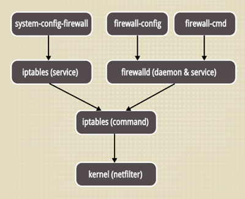

# centOS 7 中 firewall 的使用

CentOS 7 版本使用了 firewall 作为防火墙，这里是一些使用到的操作。



### 查看状态

```shell
$ firewall-cmd --state
```

### 开启端口

```
$ firewall-cmd --zone=public --add-port=80/tcp --permanent
```

命令含义：

--zone : 作用域

--add-port=80/tcp : 添加端口，格式为：端口/通讯协议

--permanent : 永久生效，没有此参数重启后失效

修改开启端口过后，记得重启防火墙。

### 重启 firewall

```shell
$ firewall-cmd --reload
```

### 参考文章

[CentOS 7 下使用 Firewall](https://havee.me/linux/2015-01/using-firewalls-on-centos-7.html)
