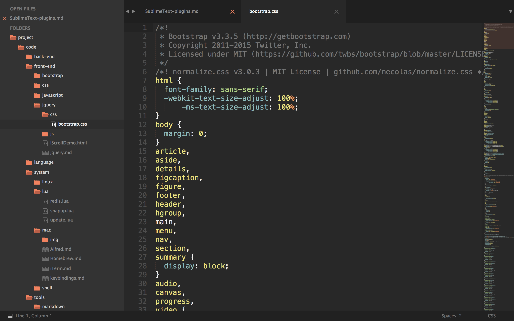

# Sublime Text 3 插件
平时使用 Sublime Test 3 时使用到的一些插件，记录一下安装和使用方法。

## Package Control
1. 通过快捷键`ctrl`+ ` 或者 View > Show Console菜单打开控制台  
2. 粘贴下面的代码后回车安装  
```
import urllib.request,os; pf = 'Package Control.sublime-package'; ipp = sublime.installed_packages_path(); urllib.request.install_opener( urllib.request.build_opener( urllib.request.ProxyHandler()) ); open(os.path.join(ipp, pf), 'wb').write(urllib.request.urlopen( 'http://sublime.wbond.net/' + pf.replace(' ','%20')).read())
```

## OmniMarkdownPreviewer
OmniMarkupPreviewer 用来预览 `Markdown` 编辑的效果，还可以生成 `html` 文件。  
1. 键入 `command + shift + p` 进入sublime的命令界面。  
2. 输入 `ins` 然后回车,键入 `ominmarkup` 选择 `OmniMarkupPreviewer`, 回车。  
3. 快捷键与 `TrailingSpacer` 冲突，将`ctrl+alt+x`设置为打开预览。

## JsFormat
写 `javascript` 代码时,按下 `Ctrl+Alt+f` 快捷键后, `js` 代码自动格式化对齐,赶快试一试吧!  

## CSScomb
官方网站的介绍 `Makes your code beautiful(让你的代码更漂亮)`。  
使用它可以帮助你重新排序`CSS`中定义的属性，帮助你按照你预定义的排序格式生成新的 `CSS`。会按照你想要的格式定义 `CSS` 空格，换行，缩进，代码编写方式。  

## TrailingSpacer
高亮行末尾的空格和`Tab`。需要设置快捷键如下：
```
[
    { "keys": ["ctrl+alt+d"], "command": "delete_trailing_spaces" },

    { "keys": ["ctrl+alt+o"], "command": "toggle_trailing_spaces" }
]
```

## Emmet
Emmet 的工作流程：打开 HTML 或 CSS 文件->按语法编写指令->摁下 TAB 键->生成！
> 输入 ! 或 html:5

```html
<!doctype html>
<html lang="en">
<head>
    <meta charset="UTF-8">
    <title>Document</title>
</head>
<body>
</body>
</html>
```
[Emmet API](http://docs.emmet.io/cheat-sheet/)

## SideBarEnhancements
边栏右键增强插件。

## DocBlockr
注释插件

## PreDawn
主题插件，效果图如下：

直接使用 `Package Control` 安装。设置如下，在 `Settings-User` 下面添加如下内容：
```
// Panel Options
"predawn_findreplace_small": false,
"predawn_quick_panel_small": false,

// Sidebar Options
"predawn_sidebar_arrows": false,
"predawn_sidebar_large": false,
"predawn_sidebar_medium": false,
"predawn_sidebar_narrow": false,
"predawn_sidebar_small": false,
"predawn_sidebar_xlarge": false,
"predawn_sidebar_xsmall": false,

// Tabs Options

"predawn_tabs_active_underline": false,
"predawn_tabs_large": false,
"predawn_tabs_medium": false,
"predawn_tabs_small": false
```

## MarkdownLight
`Markdown` 文件使用了该插件显示 `Dark` 主题，下过图如下：

设置：在 `Settings` — `More` → `Syntax Specific` — `User`. 添加如下的内容：
```
{
    "color_scheme": "Packages/MarkdownLight/MarkdownDark.tmTheme"
}
```